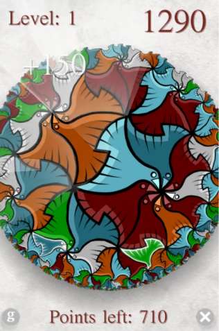
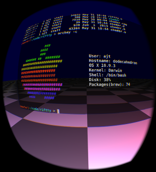
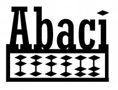

## Anthony Thibault

# About

I’m a software engineer based in San Francisco, CA specializing in developing technology for video games and virtual reality.
My passion is applying my experience in real-time 3D graphics and animation to emerging platforms such as VR and spatial computing.

If this is something you’re working on I'd love to [hear](mailto:ajt.hyperlogic@gmail.com) from you.

# Professional Projects

My professional work experience is available here in [PDF form](files/Resume_of_Anthony_Thibault.pdf) or via [Google Docs](https://docs.google.com/document/d/1E19TSGQWVu8wrfGwm44TjcaXZLOd2wm9-tLb0BXHnSQ).

# Personal projects

## Circull

I developed a mobile game inspired by the artwork of [M.C. Escher](https://mcescher.com/gallery/most-popular/), specifically his application of tiling figures in hyperbolic geometry.
Not being a trained mathematician, learning the underlying theory was challenging but rewarding.
Using my research, I created custom tools and artwork to complete this project in 2010.

Recently, I recompiled the old C++ code into JavaScript using [emscripten](https://emscripten.org/), this game is now fully playable in your browser [here](circull/circull.html).

## Riftty

In 2012, I was one of the lucky backers of the original Oculus Rift kickstarter.
I was so excited about the potential for developing software while in VR.
I created a custom [terminal application](https://github.com/hyperlogic/riftty) for the DK1 running on Apple macOS. I learned some cool techniques to maximize the quality and legibility of text in VR.
As well as some important lessons in ergonomics.
While it sounds fun to edit your code on a 50 foot billboard sized screen, in practice it can lead to a stiff neck.

## Abaci

I developed a header-only C++ library for 3D math. Specifically targeted to 3D rendering and gameplay. I’ve since moved on to the more standard glm library, but I still use it occasionally.

## GlyphBlaster

I undertook this [project](https://github.com/hyperlogic/glyphblaster) to improve the quality of text in my personal projects.
It was inspired by the State of Text Rendering article by Behdad Esfahbod.
My goal wasto create the highest quality text rendering I could in OpenGL, including full unicode support including glyph-shaping and right to left languages.
I integrated several open source libraries such as FreeType2, HarfBuzz and ICU to achieve my goal.
This project was later used in Riftty.

